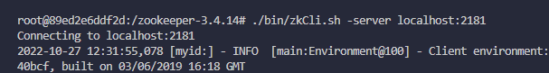

# Lab 4. Gribanov Danil. ZooKeeper
## How to start
Run docker via `docker-compose up --build` and when you can attach to this docker.

## How connect to ZooKeeper in shell
Attach via `./bin/zkCli.sh -server localhost:2181`.

And we can work with zoo via cli:



But in our case, we will try kazoo library, which are very similar to ZooKeeper, but in python.

After you launch docker - run next commands (in `/home/lab_4` folder):
```
./additional_setup.sh
./run.jp.sh
```


## Examples
Could be found in notebook `examples.ipynb`.

## Solved tasks
Two tasks are done via kazoo and can be found in:
- task_1_DiningPhilosophers.py
- task_2_TwoPhaseCommit.py
